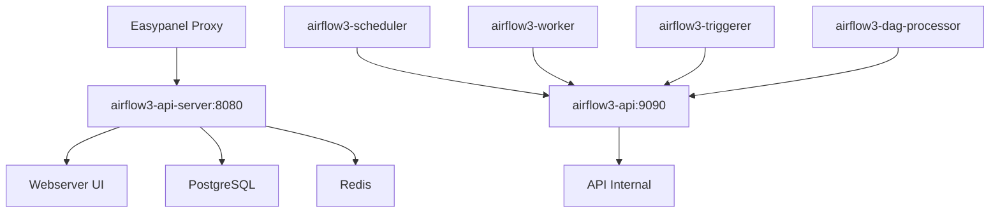

# 🚀 Instruções de Deploy - Airflow 3.0.6

## 🚨 Problema Identificado e Solucionado

**Problema**: URL redirecionando incorretamente de:
- ✅ `https://lakehouse-finance3-airflow3.hjbbqx.easypanel.host/`  
- ❌ `http://airflow3-api-server:8080/auth/login/?next=https://lakehouse-finance3-airflow3.hjbbqx.easypanel.host/`

**Causa**: Configuração inadequada de proxy reverso no Airflow 3.0.6

## 🔧 Correções Implementadas

### 1. **Separação de Serviços**
- `airflow3-api-server` → `airflow3-webserver` (UI pública na porta 8080)
- `airflow3-api` → API interna (comunicação entre serviços na porta 9090)

### 2. **Configurações de Proxy Reverso**
```yaml
AIRFLOW__WEBSERVER__BASE_URL: https://lakehouse-finance3-airflow3.hjbbqx.easypanel.host
AIRFLOW__WEBSERVER__ENABLE_PROXY_FIX: True
AIRFLOW__WEBSERVER__PROXY_FIX_X_FOR: 1
AIRFLOW__WEBSERVER__PROXY_FIX_X_PROTO: 1  
AIRFLOW__WEBSERVER__PROXY_FIX_X_HOST: 1
AIRFLOW__WEBSERVER__PROXY_FIX_X_PORT: 1
AIRFLOW__WEBSERVER__PROXY_FIX_X_PREFIX: 1
AIRFLOW__WEBSERVER__ALLOWED_HOSTS: lakehouse-finance3-airflow3.hjbbqx.easypanel.host
```

### 3. **Segurança e Cookies**
```yaml
AIRFLOW__WEBSERVER__COOKIE_SECURE: True
AIRFLOW__WEBSERVER__COOKIE_SAMESITE: None
```

## 📋 Passos para Deploy

### 1. **Verificar Variáveis de Ambiente**
No Easypanel, confirmar que estão definidas:
```env
# ==== URLs e Proxy ====
AIRFLOW__WEBSERVER__BASE_URL=https://lakehouse-finance3-airflow3.hjbbqx.easypanel.host
AIRFLOW__WEBSERVER__ENABLE_PROXY_FIX=True
AIRFLOW__WEBSERVER__PROXY_FIX_X_FOR=1
AIRFLOW__WEBSERVER__PROXY_FIX_X_PROTO=1
AIRFLOW__WEBSERVER__PROXY_FIX_X_HOST=1
AIRFLOW__WEBSERVER__PROXY_FIX_X_PORT=1
AIRFLOW__WEBSERVER__PROXY_FIX_X_PREFIX=1
AIRFLOW__WEBSERVER__ALLOWED_HOSTS=lakehouse-finance3-airflow3.hjbbqx.easypanel.host

# ==== Cookies e Segurança ====
AIRFLOW__WEBSERVER__COOKIE_SECURE=True
AIRFLOW__WEBSERVER__COOKIE_SAMESITE=None

# ==== Secrets (usar as mesmas chaves) ====
AIRFLOW_SECRET_KEY=f7285c3767c18f2d08bdf81246d6145541b7cf3206a2e345d41563a54fb2ef9296b9378263fc101550784cb17584db124e8cb851f93225061514a294ef39d791
AIRFLOW__API__SECRET_KEY=f7285c3767c18f2d08bdf81246d6145541b7cf3206a2e345d41563a54fb2ef9296b9378263fc101550784cb17584db124e8cb851f93225061514a294ef39d791

# ==== NO_PROXY (comunicação interna) ====  
NO_PROXY=localhost,127.0.0.1,airflow3-api-server,airflow3-api,postgres3,redis3
```

### 2. **Fazer Deploy**
1. Parar o stack atual no Easypanel
2. Fazer pull das mudanças do Git
3. Verificar se o arquivo `config/webserver_config.py` foi criado
4. Iniciar o stack novamente
5. Aguardar todos os serviços ficarem healthy

### 3. **Verificar Funcionamento**
- ✅ Acesso: `https://lakehouse-finance3-airflow3.hjbbqx.easypanel.host`
- ✅ Login com: `diego` / `Dg@24282323`
- ✅ URL deve permanecer com HTTPS e domínio correto
- ✅ Navegação entre páginas sem redirecionamento incorreto

## 🔍 Troubleshooting

### Se o problema persistir:

#### 1. **Verificar Logs**
```bash
# Ver logs do webserver
docker-compose logs airflow3-api-server

# Ver logs do API
docker-compose logs airflow3-api  

# Ver logs de inicialização
docker-compose logs airflow3-init
```

#### 2. **Verificar Configurações**
```bash
# Dentro do container do webserver
docker-compose exec airflow3-api-server airflow config get-value webserver base_url
docker-compose exec airflow3-api-server printenv | grep AIRFLOW__WEBSERVER
```

#### 3. **Verificar Health Checks**
```bash
# Status dos serviços
docker-compose ps

# Testar healthcheck manualmente
docker-compose exec airflow3-api-server curl -fsS http://localhost:8080/health
```

#### 4. **Limpar Cache/Cookies**
- Limpar cookies do navegador para o domínio
- Usar modo incógnito para testar
- Testar em navegadores diferentes

### Se ainda não funcionar:

#### **Opção A: Forçar Rebuild**
```bash
docker-compose down -v
docker-compose build --no-cache
docker-compose up -d
```

#### **Opção B: Verificar Proxy do Easypanel**
- Confirmar se o Easypanel está fazendo proxy correto para a porta 8080
- Verificar se os headers `X-Forwarded-*` estão sendo enviados

#### **Opção C: Debug Headers**
Adicionar temporariamente no webserver_config.py:
```python
import logging
logging.getLogger('werkzeug').setLevel(logging.DEBUG)
```

## 🎯 Arquitetura Final



## 📞 Suporte

Se o problema persistir após seguir todos os passos:

1. **Verificar logs detalhados** de todos os serviços
2. **Comparar** as variáveis de ambiente com este documento  
3. **Testar** em modo incógnito do navegador
4. **Contactar** a equipe técnica com os logs específicos

---

💡 **Dica**: O arquivo `docker-compose-backup.yaml` contém a versão original caso precise reverter as mudanças.